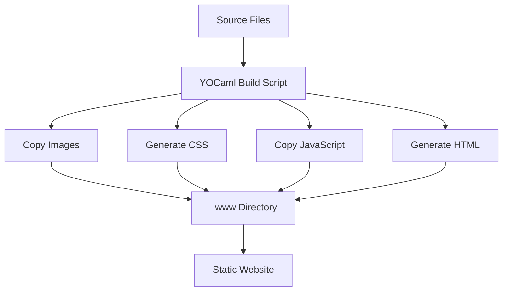

# Architecture Documentation

This document explains the technical architecture and code structure of the Okhuomon portfolio website.

## 🏗️ Build System Architecture

### OCaml Build Pipeline

The project uses **YOCaml** as the static site generator, which provides a functional approach to building websites:

```ocaml
(* bin/blog.ml - Main build script *)

open Yocaml

let www = Path.rel [ "_www" ]
let templates = Path.rel [ "templates" ]

(* Copy static assets *)
let copy_images =
  let images_path = Path.(www / "images")
  and where = with_ext [ "svg"; "png"; "jpg"; "gif" ] in
  Batch.iter_files ~where images (Action.copy_file ~into:images_path)

(* Generate main CSS file *)
let create_css =
  let css_path = Path.(www / "style.css") in
  Action.Static.write_file css_path
    (Pipeline.pipe_files ~separator:"\n"
       Path.[ css / "sticky-cards.css" ])

(* Copy JavaScript files *)
let copy_js =
  let js_path = Path.(www / "js")
  and where = with_ext [ "js" ] in
  Batch.iter_files ~where (Path.rel [ "js" ]) (Action.copy_file ~into:js_path)

(* Generate main page from template *)
let create_index_page =
  let template_path = Path.(templates / "main.html") in
  Action.copy_file template_path ~into:www ~new_name:"index.html"
```

### Build Process Flow



## 🎨 Frontend Architecture

### Component System

The website uses a modular JavaScript component system:

```javascript
// js/component-loader.js - Component initialization

class ComponentLoader {
  constructor() {
    this.components = new Map();
    this.init();
  }

  init() {
    // Load all components
    this.loadComponent("folder-gallery", FolderComponent);
    this.loadComponent("location-time", LocationTimeWidget);
  }

  loadComponent(selector, ComponentClass) {
    const elements = document.querySelectorAll(`[data-${selector}]`);
    elements.forEach((element) => {
      const component = new ComponentClass(element);
      this.components.set(element, component);
    });
  }
}

// Initialize when DOM is ready
document.addEventListener("DOMContentLoaded", () => {
  new ComponentLoader();
});
```

### GSAP Animation System

```javascript
// Animation configuration and setup

const initGSAP = () => {
  // Register ScrollTrigger plugin
  gsap.registerPlugin(ScrollTrigger);

  // Initialize smooth scrolling
  const lenis = new Lenis({
    duration: 1.2,
    easing: (t) => Math.min(1, 1.001 - Math.pow(2, -10 * t)),
    direction: "vertical",
    smooth: true,
  });

  // Connect Lenis with ScrollTrigger
  lenis.on("scroll", ScrollTrigger.update);
  gsap.ticker.add((time) => {
    lenis.raf(time * 1000);
  });
};
```

## 📁 File Structure Deep Dive

### Templates Directory

```
templates/
└── main.html              # Single template file
    ├── <head>             # Meta tags, CSS links
    ├── <style>            # Inline CSS for performance
    ├── <body>             # Main content structure
    └── <script>           # JavaScript functionality
```

### CSS Architecture

```
css/
├── sticky-cards.css       # Card animation styles
│   ├── .card              # Base card styling
│   ├── .card-inner        # Card content wrapper
│   └── @keyframes         # Animation definitions
└── folder-hover.css       # Interactive element styles
    ├── .folder-section    # Folder gallery layout
    ├── .folder-item       # Individual folder styling
    └── .hover-effects     # Interactive states
```

### JavaScript Components

```
js/
├── component-loader.js    # Component initialization system
├── folder-component.js    # Folder gallery functionality
└── location-time.js       # Time widget component
```

## 🔧 Configuration Files

### Dune Project Configuration

```ocaml
(* dune-project *)
(lang dune 3.0)

(name okhuomon)

(package
 (name okhuomon)
 (depends
  ocaml
  yocaml
  yocaml_unix
  yocaml_yaml
  yocaml_markdown
  yocaml_jingoo
  hilite))
```

### OPAM Package Definition

```opam
(* okhuomon.opam - Generated by dune *)
opam-version: "2.0"
depends: [
  "dune" {>= "3.0"}
  "ocaml"
  "yocaml"
  "yocaml_unix"
  "yocaml_yaml"
  "yocaml_markdown"
  "yocaml_jingoo"
  "hilite"
]
```

## 🚀 Performance Optimizations

### Static Generation Benefits

- **Pre-compiled HTML** - No server-side rendering needed
- **CDN-friendly** - Can be served from any static host
- **Fast loading** - No database queries or dynamic content

### Asset Optimization

```javascript
// Lazy loading for images
const lazyImages = document.querySelectorAll("img[data-src]");
const imageObserver = new IntersectionObserver((entries) => {
  entries.forEach((entry) => {
    if (entry.isIntersecting) {
      const img = entry.target;
      img.src = img.dataset.src;
      imageObserver.unobserve(img);
    }
  });
});
```

### CSS Optimization

```css
/* Critical CSS inlined in main.html */
.header-section {
  background-color: #f4f7f0;
  width: 100%;
  padding: 100px 0px 0px 0px;
  margin-bottom: -70px;
  position: relative;
  z-index: 10;
}

/* Non-critical CSS loaded separately */
@import url("/css/sticky-cards.css");
```

## 🔄 Development Workflow

### Local Development

```bash
# Start development server with hot reload
dune exec bin/blog.exe server

# Build for production
dune exec bin/blog.exe

# Clean build artifacts
dune clean
```

### Build Pipeline

1. **Asset Collection** - Copy images, CSS, JS files
2. **Template Processing** - Generate HTML from templates
3. **Optimization** - Minify and optimize assets
4. **Output Generation** - Create `_www/` directory

This architecture provides a clean separation between content (templates), styling (CSS), and functionality (JavaScript), while leveraging OCaml's type safety and YOCaml's powerful static generation capabilities.
